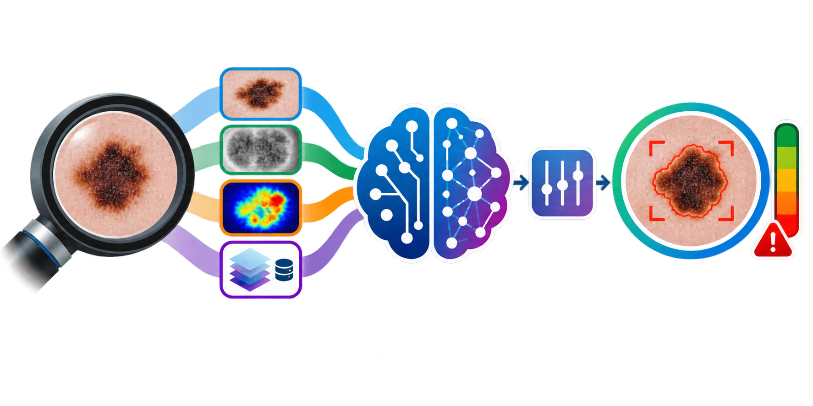
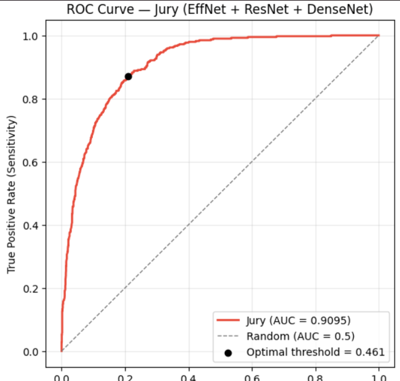
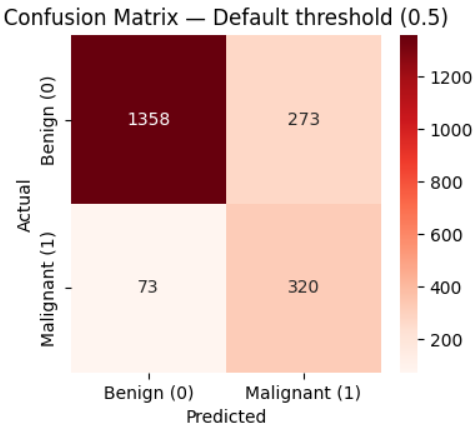
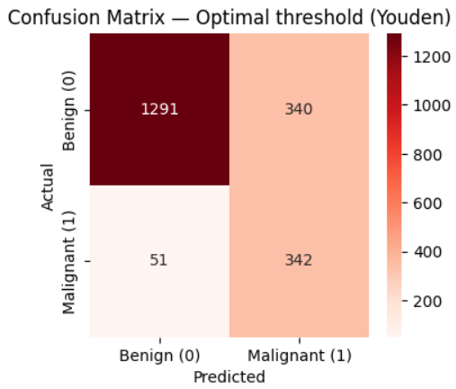

<p align="center">
  
</p>

---

# Dermascope AI: A Multimodal Deep Learning System for Early Melanoma Detection via Feature-wise Linear Modulation

> **CHI Lab ECR Research Project — Computational Dermatology & Medical Imaging AI**

---

## Purpose of This Repository

This GitHub repository serves as a structured, reproducible research workspace for the **Dermascope AI** project, developed as part of **CHI Lab ECR research activities**. The project integrates:

- Deep learning-based **binary classification** of dermoscopic skin lesion images (Benign vs. Malignant/Suspect)
- Multimodal data fusion combining visual features with clinical metadata
- **Feature-wise Linear Modulation (FiLM)** for metadata-conditioned image classification
- Transfer learning using **EfficientNet-B4** pretrained on ImageNet (with ResNet-50 and DenseNet-121 alternatives)
- Advanced image preprocessing: **DullRazor** hair removal, **SAM**-guided lesion segmentation, **Medical Bokeh** background suppression
- Class imbalance handling via **Focal Loss** (α=0.75, γ=2.0) and asymmetric data augmentation
- **Test-Time Augmentation (TTA)** with 5 geometric views for robust inference
- Clinically optimised decision threshold (0.4607) for melanoma sensitivity
- **Gradio** web interface for interactive clinical demonstration
- Reproducible computational experiments and scientific documentation

> ⚠️ **Medical Disclaimer:** This system is a research prototype developed for educational and research purposes. It is **NOT** a certified medical device (CE/FDA). It does **NOT** replace professional dermatological assessment. Any suspicious skin lesion requires clinical evaluation and, where appropriate, biopsy. Computational results should not be interpreted as clinical advice or used for clinical decision-making without appropriate clinical validation, ethical oversight, governance, and regulatory approval.

---

## Research Background & Motivation

### The Clinical Problem

Melanoma accounts for approximately 1% of skin cancers but is responsible for **75% of skin cancer-related deaths**. Early detection dramatically improves patient outcomes:

| Stage at Detection | 5-Year Survival Rate |
|:---|:---|
| Stage I (early) | ~99% |
| Stage II | ~65% |
| Stage III | ~35% |
| Stage IV (late) | ~15% |

Expert dermatologists achieve 65–80% diagnostic accuracy on dermoscopic images. Deep learning systems have demonstrated the potential to match or exceed this performance level (Esteva et al., *Nature*, 2017).

### Research Objective

Design and implement **Dermascope AI**, a multimodal deep learning system that:

1. Performs **binary classification** of dermoscopic lesions: **Benign** (nv, bkl, df, vasc) vs. **Malignant/Suspect** (mel, bcc, akiec)
2. Integrates **19 clinical metadata features** (age, sex, anatomical localisation) via FiLM
3. Achieves **high melanoma sensitivity** (clinical priority: minimise missed cancers)
4. Provides **Test-Time Augmentation** for robust and reliable predictions
5. Implements a **Gradio**-based interface for interactive clinical demonstration

### Research Question

> *Can a multimodal deep learning architecture combining dermoscopic image analysis with clinical metadata through Feature-wise Linear Modulation (FiLM) improve melanoma detection sensitivity compared to image-only classification approaches?*

---

## Dataset — ISIC / HAM10000

| Property | Detail |
|:---|:---|
| **Name** | HAM10000 (Human Against Machine with 10,000 training images) |
| **Source** | [](https://www.isic-archive.com/) [](https://www.kaggle.com/datasets/kmader/skin-cancer-mnist-ham10000) |
| **Total Images** | 10,015 dermoscopic images |
| **Image Resolution** | Resized to 512×512 RGB |
| **Task** | Binary classification |
| **Annotation** | Histopathologically confirmed or expert consensus |
| **Metadata** | Age, sex (3 categories), anatomical localisation (15 categories) |

### Binary Grouping Strategy

The original 7 diagnostic categories are grouped into a clinically meaningful binary classification:

| Group | Original Classes | Clinical Rationale |
|:---|:---|:---|
| **Malignant / Suspect** ⚠️ | `mel` (Melanoma), `bcc` (Basal cell carcinoma), `akiec` (Actinic keratosis) | Life-threatening or pre-malignant — require clinical intervention |
| **Benign** ✅ | `nv` (Naevus), `bkl` (Benign keratosis), `df` (Dermatofibroma), `vasc` (Vascular lesion) | Low risk — routine monitoring |

> **Important:** Do not upload restricted, confidential, patient-identifiable, or otherwise sensitive healthcare data to this repository. Use public, synthetic, or appropriately de-identified datasets and comply with the relevant dataset licence, terms of use, and data-governance requirements.

---

## System Architecture

```text
┌──────────────────────────────────────────────────────────────────────────────┐
│                   DERMASCOPE AI — MULTIMODAL FiLM ARCHITECTURE               │
│                                                                              │
│  📸 Input: Dermoscopic Image (512×512 RGB) + Clinical Metadata (19 features) │
│                                                                              │
│  ┌─────────────────────────────┐   ┌─────────────────────────────────┐       │
│  │   IMAGE BRANCH               │   │   METADATA BRANCH                │       │
│  │                             │   │                                 │       │
│  │  Preprocessing:             │   │  Input: 19 features             │       │
│  │  ├── DullRazor (hair)       │   │  ├── Age (normalised /85)       │       │
│  │  ├── SAM lesion segment.    │   │  ├── Sex (3-dim one-hot)        │       │
│  │  ├── Medical Bokeh blur     │   │  └── Localisation (15-dim OH)   │       │
│  │  └── Resize → 512×512      │   │                                 │       │
│  │                             │   │  MLP Encoder:                   │       │
│  │  EfficientNet-B4:           │   │  ├── Linear(19 → 64)+BN+SiLU   │       │
│  │  ├── Pretrained ImageNet    │   │  ├── Dropout(0.2)               │       │
│  │  └── Features → 1792-dim   │   │  └── Linear(64 → 32)+BN+SiLU   │       │
│  │                             │   │      Output: 32-dim vector      │       │
│  │  Compression:               │   │                                 │       │
│  │  └── Linear(1792→512)+BN+SiLU│   └─────────────────────────────────┘       │
│  │      Output: 512-dim vector │                    │                        │
│  └──────────────┬──────────────┘                    │                        │
│                 │                                    │                        │
│                 ▼                                    ▼                        │
│  ┌───────────────────────────────────────────────────────────┐               │
│  │                   FiLM MODULATION LAYER                    │               │
│  │      output = vision × (1 + γ(tabular)) + β(tabular)      │               │
│  │      γ : Linear(32 → 512)    β : Linear(32 → 512)         │               │
│  └───────────────────────────┬───────────────────────────────┘               │
│                              ▼                                               │
│  ┌───────────────────────────────────────────────────────────┐               │
│  │                 CLASSIFICATION HEAD                        │               │
│  │  ├── Linear(512 → 256) + BatchNorm + SiLU                │               │
│  │  ├── Dropout(0.4)                                         │               │
│  │  └── Linear(256 → 1) → Sigmoid                           │               │
│  └───────────────────────────┬───────────────────────────────┘               │
│                              ▼                                               │
│  ┌───────────────────────────────────────────────────────────┐               │
│  │                      OUTPUT                                │               │
│  │  ├── Binary prediction: Benign (0) vs. Malignant (1)      │               │
│  │  └── Probability score (clinical threshold: 0.4607)       │               │
│  └───────────────────────────────────────────────────────────┘               │
└──────────────────────────────────────────────────────────────────────────────┘
```

### Supported Backbones

| Model | Parameters | Features | Selection |
|:---|:---|:---|:---|
| **EfficientNet-B4** | 19M | 1792-dim | **✅ Primary backbone** |
| ResNet-50 | 25.6M | 2048-dim | Alternative (via `Dermascope_FiLM_Alternative`) |
| DenseNet-121 | 8M | 1024-dim | Alternative (via `Dermascope_FiLM_Alternative`) |

All backbones pass through a shared compression layer (→ 512-dim) before FiLM modulation, ensuring architecture consistency.

### Why Feature-wise Linear Modulation (FiLM)?

FiLM (Perez et al., 2018) provides an elegant mechanism for conditioning visual features on auxiliary metadata:

$$\text{FiLM}(v, t) = v \odot (1 + \gamma(t)) + \beta(t)$$

where $v$ is the compressed visual feature vector (512-dim), and $\gamma(t)$, $\beta(t)$ are learned affine transformation parameters generated from the 32-dim tabular encoding. This allows the model to dynamically modulate its visual processing based on patient demographics and lesion localisation — mimicking how dermatologists contextualise visual patterns with clinical information.

---

## Image Preprocessing Pipeline

```text
Raw Dermoscopic Image (600×450)
        │
        ▼
┌──────────────────────────────────┐
│  1. DullRazor Hair Removal       │
│  ├── Black-Hat filter (17×17)    │
│  ├── Top-Hat filter (17×17)      │
│  ├── Combined mask + dilation    │
│  └── Telea inpainting (r=5)     │
└──────────────┬───────────────────┘
               ▼
┌──────────────────────────────────┐
│  2. SAM Lesion Segmentation      │
│  ├── CIELAB colour space         │
│  ├── Skin-border sampling        │
│  ├── Anomaly map + central bias  │
│  └── SAM point-guided mask       │
└──────────────┬───────────────────┘
               ▼
┌──────────────────────────────────┐
│  3. Medical Bokeh                │
│  ├── Gaussian blur (85×85)       │
│  ├── Soft mask feathering (25×25)│
│  └── Alpha blending              │
└──────────────┬───────────────────┘
               ▼
     Clean 512×512 Image
```

---

## Project Structure

```text
Dermascope-AI-Melanoma-Detection/
│
├── README.md                              # This file
├── LICENSE                                # Project licence
├── requirements.txt                       # Python dependencies
├── .gitignore                             # Git ignore rules
│
├── assets/                                # Logo and demo dermoscopic images
│   ├── Dermascope-AI-Melanoma-Detection.png
│   └── *.jpg                              # Sample test images
│
├── src/                                   # Source code
│   ├── __init__.py                        # Package init
│   ├── config.py                          # Hyperparameters and paths
│   ├── preprocessing.py                   # DullRazor + SAM + Medical Bokeh
│   ├── dataset.py                         # Dataset class and data loading
│   ├── model.py                           # FiLM architecture and Focal Loss
│   ├── train.py                           # Training with differential LRs
│   ├── evaluate.py                        # Clinical metrics and ROC analysis
│   └── utils.py                           # Inference utilities and TTA
│
├── app/                                   # Gradio demo application
│   └── gradio_app.py                      # Interactive web interface
│
├── notebooks/                             # Jupyter / Colab notebooks
│   └── dermascope_colab_brut.ipynb        # Colab training notebook
│
├── data/                                  # Processed data splits
│   ├── train_df_clean.csv                 # Training set metadata
│   └── val_df_clean.csv                   # Validation set metadata
│
├── models/                                # Saved model checkpoints
│
├── results/                               # Evaluation outputs
│
├── docs/                                  # Research documentation
│   ├── Dermascope_AI_Research_Paper_CHI_Lab_2026.md
│   └── Dermascope_AI_Research_Paper_CHI_Lab_2026.pdf
│
├── scripts/                               # Utility scripts
│
└── tests/                                 # Unit tests
```

---

## Training Strategy

### End-to-End Training with Differential Learning Rates

Unlike standard two-phase transfer learning, Dermascope AI employs **single-phase end-to-end training** with component-specific learning rates, allowing the entire network to co-adapt from the start:

| Component | Learning Rate | Rationale |
|:---|:---|:---|
| `model.vision` — EfficientNet-B4 backbone | 1×10⁻⁵ | Minimal perturbation of pretrained features |
| `model.compress` — Visual compression layer | 5×10⁻⁴ | Adapt dimension reduction to domain |
| `model.tabular` — Metadata MLP encoder | 1×10⁻³ | Learn tabular encoding from scratch |
| `model.film` + `model.classifier` — Fusion head | 5×10⁻⁴ | Learn FiLM modulation and classification |

**Optimiser:** AdamW (weight_decay=1×10⁻⁴)

**Scheduler:** CosineAnnealingWarmRestarts (T₀=5, T_mult=2)

**Mixed Precision:** `torch.amp.autocast` with `GradScaler`

**Gradient Accumulation:** 2 steps (effective batch size = 16)

**Early Stopping:** Patience = 6 epochs on validation loss

### Class Imbalance Strategy

1. **Focal Loss** (α=0.75, γ=2.0) — Up-weights the malignant minority class, down-weights well-classified benign examples
2. **Asymmetric Data Augmentation:**
   - Benign (moderate): Rotation 30°, Brightness ±0.3, Contrast ±0.3
   - Malignant (aggressive): Rotation 360°, Affine translation ±10%, Scale 0.85–1.15, Brightness ±0.4, Contrast ±0.4
3. **Optimised Decision Threshold** (0.4607) — Tuned to maximise melanoma sensitivity on the validation set

### Metadata Encoding

| Feature | Encoding | Dimensions |
|:---|:---|:---|
| Age | Continuous, normalised by max age (85) | 1 |
| Sex | One-hot (Female, Male, Unknown) | 3 |
| Localisation | One-hot (15 anatomical sites) | 15 |
| **Total** | | **19** |

---

## Inference — Test-Time Augmentation (TTA)

At inference time, the model averages predictions over **5 geometric views** to improve robustness:

1. Original image
2. Horizontal flip
3. Vertical flip
4. 90° rotation
5. 180° rotation

All views are evaluated under `torch.amp.autocast` for efficient mixed-precision inference.

---

## Performance Targets

| Metric | Target |
|:---|:---|
| **Sensitivity (Recall)** — Malignant | > 0.90 ⚠️ |
| **Specificity** — Benign | > 0.85 |
| **Balanced Accuracy** | > 0.85 |
| **ROC-AUC** | > 0.95 |

> **Clinical priority:** Melanoma sensitivity (recall) is the most critical metric. Missing a melanoma is far more dangerous than a false alarm. The decision threshold is tuned at **0.4607** (below the standard 0.5) to favour sensitivity.

---

## Getting Started

### Prerequisites

- Python 3.9+
- CUDA-capable GPU (recommended: T4 16 GB or equivalent)
- 16 GB RAM minimum

### Installation

```bash
# Clone the repository
git clone https://github.com/partnerships2024/Dermascope-AI-Melanoma-Detection.git
cd Dermascope-AI-Melanoma-Detection

# Create virtual environment
python -m venv venv
source venv/bin/activate        # Linux/macOS
# venv\Scripts\activate         # Windows

# Install dependencies
pip install -r requirements.txt
```

### Dataset Download

```bash
# Option 1: Kaggle CLI
kaggle datasets download -d kmader/skin-cancer-mnist-ham10000
unzip skin-cancer-mnist-ham10000.zip -d data/HAM10000/

# Option 2: ISIC Archive
# Visit https://www.isic-archive.com/ and download HAM10000
```

### Training

```bash
python -m src.train
```

### Evaluation

```bash
python -m src.evaluate --checkpoint models/best_model.pth
```

### Gradio Demo

```bash
python -m app.gradio_app
```
## 📊 Experimental Results: Model Performance & Clinical Safety

To validate the effectiveness of our FiLM-conditioned ensemble, we evaluated the system on the ISIC 2020 validation set. By optimising the decision threshold using the Youden Index, we significantly reduced the false negative rate, which is critical for clinical melanoma screening.

<div align="center">
  
</div>

<br>

<div align="center">
  
  
</div>
---

### Dataset Bias Considerations

The HAM10000 dataset has known limitations:
- **Skin type bias** — Predominantly Fitzpatrick skin types I–III (fair skin)
- **Geographic bias** — Primarily European patient population
- **Age distribution** — May not represent all demographic groups equally
- **Imaging conditions** — Captured under controlled dermoscopic conditions; performance may degrade on consumer-grade photographs

### Motivational Research Papers 

[](https://www.cs.jhu.edu/~zongwei/publication/bassi2025learning.pdf)

[](https://www.cs.jhu.edu/~zongwei/publication/bassi2025learning.pdf)

[](https://www.cs.jhu.edu/~zongwei/publication/bassi2025learning.pdf)

---

# Citation & Attribution

When using external datasets, models, software, code, or published methodologies:

1. Cite the original research publication.
2. Cite the dataset and its source.
3. Follow the applicable dataset and software licences.
4. Acknowledge the original authors and contributors.
5. Clearly distinguish reproduced work from original contributions.
6. Document any modifications made to the original methodology or implementation.

### Example Citation

```bibtex
@misc{dermascope_ai_chi_lab,
  title        = {Dermascope AI: A Multimodal Deep Learning System for Early Melanoma Detection via Feature-wise Linear Modulation},
  author       = {Computational Healthcare Intelligence Lab},
  year         = {2026},
  organization = {International Council for Research \& Innovation in STE (ICRI-STE)},
  url          = {https://github.com/partnerships2024/Dermascope-AI-Melanoma-Detection}
}
```

### Key References

```bibtex
@article{tschandl2018ham10000,
  title     = {The HAM10000 dataset, a large collection of multi-source dermatoscopic images of common pigmented skin lesions},
  author    = {Tschandl, Philipp and Rosendahl, Cliff and Kittler, Harald},
  journal   = {Scientific Data},
  volume    = {5},
  pages     = {180161},
  year      = {2018},
  publisher = {Nature Publishing Group}
}

@article{esteva2017dermatologist,
  title     = {Dermatologist-level classification of skin cancer with deep neural networks},
  author    = {Esteva, Andre and Kuprel, Brett and Novoa, Roberto A and Ko, Justin and Swetter, Susan M and Blau, Helen M and Thrun, Sebastian},
  journal   = {Nature},
  volume    = {542},
  number    = {7639},
  pages     = {115--118},
  year      = {2017}
}

@article{perez2018film,
  title     = {FiLM: Visual Reasoning with a General Conditioning Layer},
  author    = {Perez, Ethan and Strub, Florian and de Vries, Harm and Dumoulin, Vincent and Courville, Aaron},
  journal   = {AAAI Conference on Artificial Intelligence},
  year      = {2018}
}

@article{tan2019efficientnet,
  title     = {EfficientNet: Rethinking Model Scaling for Convolutional Neural Networks},
  author    = {Tan, Mingxing and Le, Quoc V},
  journal   = {International Conference on Machine Learning (ICML)},
  year      = {2019}
}

@article{kirillov2023sam,
  title     = {Segment Anything},
  author    = {Kirillov, Alexander and Mintun, Eric and Ravi, Nikhila and others},
  journal   = {ICCV},
  year      = {2023}
}
```

---

# Research Philosophy

> **From computational experiments to reproducible scientific discovery.**

---

# Repository Vision

The long-term goal of this repository is to develop a **structured, reproducible, and collaborative research ecosystem** in which ECRs can progress from foundational research skills to advanced interdisciplinary research.

The CHI Lab research workflow can be summarised as:

```text
                     CHI LAB RESEARCH WORKFLOW

        ┌─────────────────────────────┐
        │     Research Questions      │
        └──────────────┬──────────────┘
                       ↓
        ┌─────────────────────────────┐
        │     Scientific Literature   │
        └──────────────┬──────────────┘
                       ↓
        ┌─────────────────────────────┐
        │       Data & Computing      │
        └──────────────┬──────────────┘
                       ↓
        ┌─────────────────────────────┐
        │      AI / Modelling         │
        └──────────────┬──────────────┘
                       ↓
        ┌─────────────────────────────┐
        │     Experiments & Results   │
        └──────────────┬──────────────┘
                       ↓
        ┌─────────────────────────────┐
        │ Interpretation & Validation │
        └──────────────┬──────────────┘
                       ↓
        ┌─────────────────────────────┐
        │   Reproducible Research     │
        └──────────────┬──────────────┘
                       ↓
        ┌─────────────────────────────┐
        │ Scientific Communication &  │
        │         Publication         │
        └─────────────────────────────┘
```

# Computational Healthcare Intelligence Lab (CHI Lab) 
## Research Leadership

**Dr. Didar Murad**

Principal Scientist & Founding Director

**CHI Lab, ICRI-STE** 

This project forms part of the CHI Lab's computational healthcare and cancer research activities, integrating **systems-oriented computational research, cancer genomics, and artificial intelligence/deep learning**

[](https://partnerships2024.github.io/ICRI-STE-Scientific-Events-Research-Training.github.io/)


[](https://icriste.com)

---
